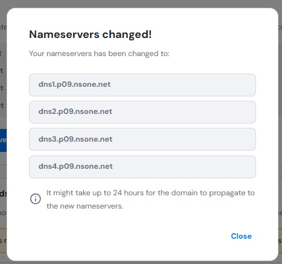

<div align="center">
   
</div>
<br />

<div align="center">
   <a href="https://github.com/alfifrr/deploy-final-checkpoint/actions/workflows/pages/pages-build-deployment">
      
   </a>
   <a href="https://app.netlify.com/sites/knowledge-overflow/deploys">
      
   </a>
   
</div>

## Table of Contents

- [Table of Contents](#table-of-contents)
  - [About this page](#about-this-page)
  - [Link to the page](#link-to-the-page)
  - [What are the contents for?](#what-are-the-contents-for)
  - [Key features](#key-features)
  - [Guide on how to install](#guide-on-how-to-install)
- [Deployment Guide](#deployment-guide)
  - [1. Deploying Your GitHub Repository to Netlify](#1-deploying-your-github-repository-to-netlify)
  - [2. Setting Up a Custom Domain](#2-setting-up-a-custom-domain)
  - [3. Updating Domain Nameservers to Point to Netlify](#3-updating-domain-nameservers-to-point-to-netlify)
  - [4. Confirm Deployment and Access Your Site](#4-confirm-deployment-and-access-your-site)
  - [Languages used](#languages-used)
  - [Licenses](#licenses)

### About this page

<div align="center">This is a platform for developers to share knowledge, ask questions, and collaborate on various topics related to programming and software development. Whether you are looking for solutions to coding problems, seeking career advice, or wanting to share your own tutorials and tips, this is the right place for you!</div>

### Link to the [page](https://alfii.site/)

### What are the contents for?

- **Post Title:** Insert your title of the topic you like
- **I want to send this:** You can schedule the time you want to send.
- **Content:** Fill out the detailed post and what the post is about there.
- **Topic:** Several checkmarks to determine which topic(s) is about.
- **Agree to the terms and conditions:** This is mandatory, you need to abide by the forum rules to create a healthy environment, by not agreeing to this will result in a disabled submit button.
- **"Post your masterpiece" button:** Make sure to double-check your post before sending it, let everyone see your thoughts!

### Key features

- You can create forum posts, discuss stuff, share ideas and thoughts, using both text and code.
- Customize the post form to include snippet codes and many more!
- This form can help ensure the quality of the posts and adhere to the community guidelines. The admin always watching 24/7.
- Animations and carousel!
- Smooth scrolling, no lagging.
- Totally responsive regardless of the device you are using!
- You can now toggle Dark Mode! (pretty cool _huh?_)
- 100% Lighthouse rating!

### Guide on how to install

1. Assuming that you already installed Git and already know how to use [Github](https://www.w3schools.com/whatis/whatis_github.asp), no? then let's head to [this link](https://git-scm.com/book/en/v2/Getting-Started-Installing-Git).
2. This is a private repository, so you have to clone it using SSH, but before that let's use an email that is already authorized by Github to view the private repository. [More on that here](https://leangaurav.medium.com/setup-ssh-key-with-git-github-clone-private-repo-using-ssh-d983ab7bb956).
3. Generate an SSH key on your machine using the registered email:
   ```bash
   ssh-keygen -t ed25519 -C "your_email@example.com"
   ```
   Using an older system? then use this command:
   ```bash
   ssh-keygen -t rsa -b 4096 -C "your_email@example.com"
   ```
   Note: you have to put a password to that key and it will require you to fill a password everytime you want to interact with the repository.
4. Copy the SSH public key to your keyboard by using this command in **Linux**:
   ```bash
   cat ~/.ssh/id_rsa.pub
   ```
   For **Windows**:
   ```bash
   type %userprofile%\.ssh\id_rsa.pub
   ```
5. Navigate to your **Github account (Click on your Github's profile picture on the top right) > Settings > SSH and GPG keys > New SSH key**:
   - Title: fill the key title (which devices are you using with)
   - Key type: Authentication key
   - Key: (paste your key there)
   - Add SSH key
6. Head to the desired folder (example: `/Desktop/Projects/`) and clone the repository there
   ```bash
   git clone git@github.com:revou-fsse-oct24/module-2-alfifrr.git
   ```
   Don't forget to access the cloned repository
   ```bash
   cd /module-2-alfifrr
   ```
7. Assuming that you're using Visual Studio Code, access the `index.html` file using [this Visual Studio Code extension](https://marketplace.visualstudio.com/items?itemName=ritwickdey.LiveServer) or clicking on it directly to see on your browser (but you have to reload manually using `F5` key or refresh button every time you made some changes). Also you can access the `README.md` file using this shortcut: `CTRL+K` then `V`

## Deployment Guide

### 1. Deploying Your GitHub Repository to Netlify

1. **Sign up or log into Netlify:**

   - Go to [Netlify](https://www.netlify.com/) and log in or sign up if you don’t have an account.
   - Note: Verifying sign up process using your e-mail is somewhat tricky so make sure you have stable internet connection or consider changing your connection to another provider.

2. **Netlify form**:

   - Fill in your first name, last name, the usage of your Netlify and the purpose of deploying the website, like this example picture below.
   - 

3. **Link GitHub Repository:**

   - Connect your GitHub account and grant Netlify access to the repository. Netlify will ask for your permission. Choose **Authorize.**
   - Then choose your sub-account that has the deployable web project and it is not a private repository for the Netlify to be installed in. For example, select _alfifrr_.
   - 
   - Then select a repository to be deployed with Netlify using "Only select repositories". For example, select _alfifrr/deploy-final-checkpoint_. It will show up below the selection.
   - 
   - You might have to confirm access again after selecting the repository by re-entering your GitHub's password.

4. **Choose Repository and Configure Settings:**

   - Select the repository you want to deploy.
   - Review configuration for your repository by selecting which **Team** and the **Site name**, the **Site name** shows up as the address for the deployed project, then check for the address availability by pressing the **Check availability** button, it can be changed later.
   - Select the branch to be deployed based on the branch you already deployed within GitHub environment (for example using GitHub Actions).
   - Leave the rest empty and as is.

5. **Deploy Site:**
   - Click **Deploy Site**, and Netlify will automatically start building and deploying the repository.
   - Once complete, you’ll get a default Netlify domain (e.g., `knowledge-overflow.netlify.app`), which you can use to preview your site.

---

### 2. Setting Up a Custom Domain

1. **Purchase a Domain:**

   - Go to a domain registrar, like [Niagahoster](https://www.niagahoster.com/), and buy a domain name that suits your project. Select "Cari & Cek Domain"
   - 
   - Check for the domain availability, in this case we are going to use **.site** suffix. If it's available then register the domain.
   - 
   - Choose 1 year duration, and fill in billing form consisting of your first name, last name, phone number, and your address.
   - Choose your payment option, then proceed.
   - Register your domain with your country, and select "Personal" usage, and fill in your contact address. Then wait for a while until the domain finishes registering and online.

2. **Add Custom Domain in Netlify:**

   - In your Netlify dashboard, go to **Site settings > Domain management**.
   - Under **Custom domains**, click **Add domain** and enter your purchased domain (e.g., `alfii.site`).
   - Note: you will be prompted to either use Netlify's DNS or your domain registrar, you will choose the Netlify one after this.
   - 
   - 

3. **Verify Domain Ownership (if required):**
   - Netlify might require verification for the custom domain. Follow any instructions Netlify provides for verification.

---

### 3. Updating Domain Nameservers to Point to Netlify

1. **Get Netlify Nameservers:**

   - After adding the domain in Netlify, Netlify will provide a set of nameservers. Copy these nameservers.
   - 

2. **Change Nameservers at Your Domain Registrar:**

   - Log into the account where you purchased the domain.
   - Locate **DNS settings**, **Nameservers**, or **DNS / Nameservers** options.
   - **Replace** the existing nameservers with the Netlify nameservers provided.
   - **Important!** This process requires around 1 to 24 hours so make sure you proceed this step carefully.
   - 
   - 

3. **Save Changes and Allow for Propagation:**
   - Save the new nameserver settings. Domain changes can take up to 24-48 hours (Niagahoster only requires 1-24 hours) to propagate globally.
   - 

---

### 4. Confirm Deployment and Access Your Site

- After propagation, the changes of your site should be applied and accessible via your custom domain (e.g., `alfii.site`).
- 
- Test your site in a browser to confirm everything is set up correctly.

### Languages used

- Hypertext Markup Language **(.html)**
- Markdown **(.md)**
- Cascading Style Sheets **(.css)**
- Javascript **(.js)**


### Licenses

This repository is licensed under the MIT License. &copy; 2024 Alfian Ferdinan  
HTML logo attribution by W3C, CC BY 3.0, https://commons.wikimedia.org/w/index.php?curid=12736763  
Markdown logo attribution by Dustin Curtis - https://github.com/dcurtis/markdown-mark/tree/master/svg, CC0, https://commons.wikimedia.org/w/index.php?curid=31095459  
CSS logo is licensed under the [Creative Commons Attribution 3.0 Unported](https://en.wikipedia.org/wiki/en:Creative_Commons) license. Author: Rudloff  
JS logo is licensed under the [Expat License](https://commons.wikimedia.org/wiki/Category:Expat/MIT_License), sometimes known as the **MIT License**. Copyright © Christopher Williams
